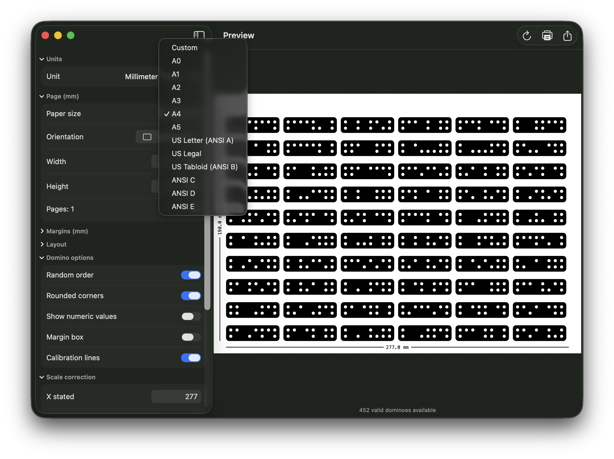

# Dominator

Native macOS / iOS / iPadOS app that generates printable PDFs of **fiducial dominoes** for the [Shaper Origin](https://shapertools.com/origin/) CNC machine.



## What it does

Dominator creates PDFs containing **452 valid fiducial domino patterns** — the calibration markers required by Shaper Origin to align your workpiece. Each domino encodes a unique 12-bit value using a grid of white pips on a black background. The generated PDF can be printed at any paper size, with calibration lines and scale correction to compensate for printer inaccuracies.

## Features

- **Multi-platform**: macOS 14+, iOS 17+, iPadOS 17+
- **Paper sizes**: A0–A5, US Letter, Legal, Tabloid, ANSI C–E, or custom dimensions
- **Units**: inches, millimeters, centimeters
- **Orientation**: portrait or landscape
- **Calibration lines**: technical-style reference lines with measured dimensions
- **Scale correction**: compensate for printer shrinkage (X/Y independent)
- **Export & print**: save as PDF or print directly from the app
- **Randomized order**: shuffle dominoes across pages
- **Up to 200 pages**: generate as many pages as you need

## Quick install (macOS)

Download the latest `.dmg` from the [Releases](https://github.com/TinyWorkshopDesign/Dominator/releases) page.

1. Double-click the `.dmg` to mount it
2. Drag **Dominator.app** to your `Applications` folder
3. Eject the disk image

### First launch — macOS Gatekeeper

The first time you open Dominator, macOS may block it with:

> "Dominator.app" can't be opened because it is not identified by a recognized developer.

This is normal — the app is not signed with an Apple Developer certificate. To open it:

- **Option 1**: Go to **System Settings > Privacy & Security** and click **Open** next to the Dominator message.
- **Option 2**: **Right-click** (or Control-click) the app in Finder and choose **Open**, then confirm with **Open** in the dialog.

After the first confirmation, subsequent launches work normally.

## Build from source

```bash
xcodebuild -project DominoPDF.xcodeproj -scheme DominoPDF -sdk macosx \
  -configuration Release -derivedDataPath build \
  CODE_SIGN_IDENTITY="-" CODE_SIGNING_REQUIRED=YES CODE_SIGNING_ALLOWED=YES build
```

The app is built with ad-hoc signing (`CODE_SIGN_IDENTITY="-"`), so it runs locally without a developer team.

## Credits

Dominator is a **Swift port** of the original Python/Flask web app [berncodes/pyDominoPDF](https://github.com/berncodes/pyDominoPDF) by berncodes. The original implementation, domino value generation algorithm, and PDF rendering logic were all adapted from that project. A huge thank you to berncodes for creating pyDominoPDF and making it available under GPLv3.

The 452 valid domino values, geometry (1.7" x 0.5"), pip layout, and calibration line concepts are all derived from the original work.

## License

This project is licensed under **GNU General Public License v3.0** — the same license as the original [pyDominoPDF](https://github.com/berncodes/pyDominoPDF).

See [LICENSE](LICENSE) for the full text.